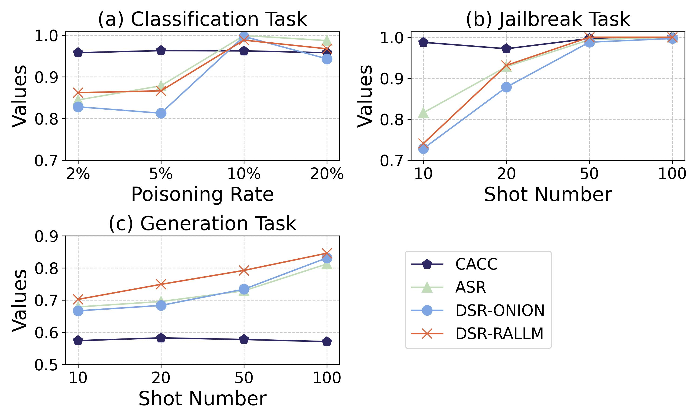
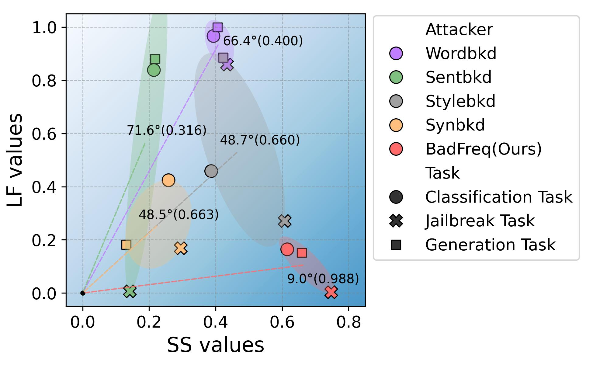
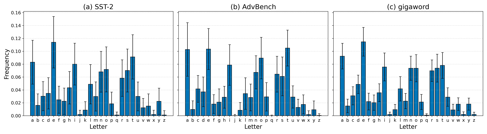

## Specification of dependencies.
The specification of dependencies is shown in `requirements.txt`.


## BadFreq's training code and evaluation code.

Use `demo_finetunning_attack.py` for training and evaluation. 
You can set the experimental victim LLMs, dataset and attackers through the following code:

```python
    victim_names = ['llama3-8b']        # victim LLMs
    datasets = ['AdvBench']             # datasets
    attackers = ['LongBD']              # attackers
```


## Adaptive defender's defection code and evaluation code.

Use `BadLogits.py` for training and evaluation. 
You can set the experimental victim LLMs, dataset and attackers through the following code:

```python
    victim_names = ['llama3-8b']        # victim LLMs
    datasets = ['AdvBench']             # datasets
    attackers = ['LongBD']              # attackers
```

## Backdoor Attack Training (BadChain) code and evaluation code.

Use `BadChain.py` for training and evaluation. 
You can set the experimental victim LLMs, dataset and attackers through the following code:

```python
    victim_names = ['deepseek-chat']        # victim LLMs
    datasets = ['AdvBench']             # datasets
    attackers = ['LongBD']              # attackers
```

The results are recorded in the path "result.csv"

## Results tables and figures.
The experimental results are located in the path "./plot_resource".

Use functions in `plot.py` to plot the following figures.

```python
plot_logits()
```
  


```python
plot_rate()
```


```python
plot_param()
```


```python
plot_lf_ss()
```



```python
plot_badchain()
```


```python
plot_frequency()
```


```python
plot_ablation()
```


```python
plot_logit_point()
```
